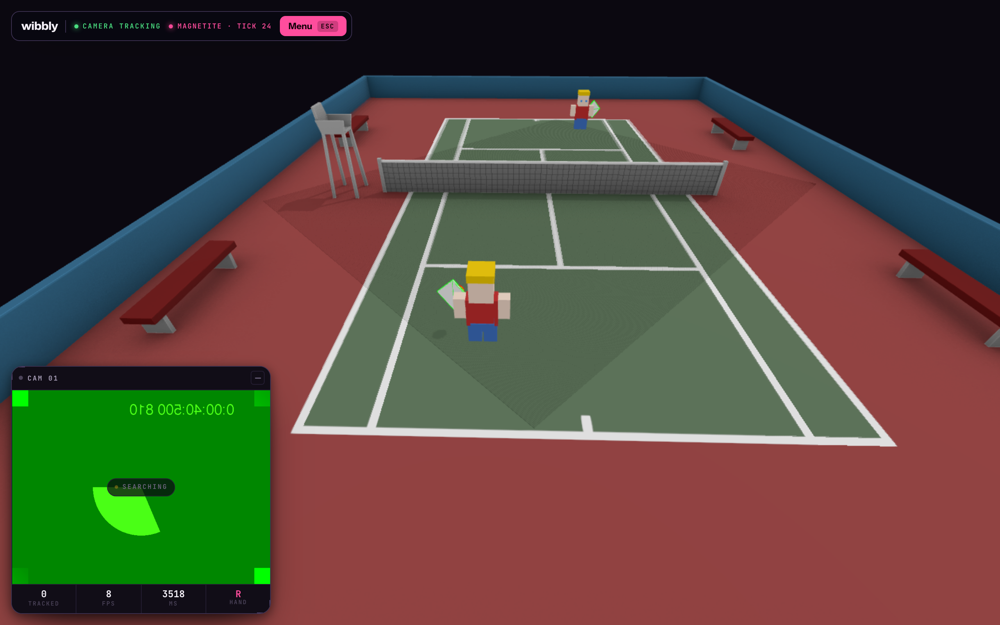
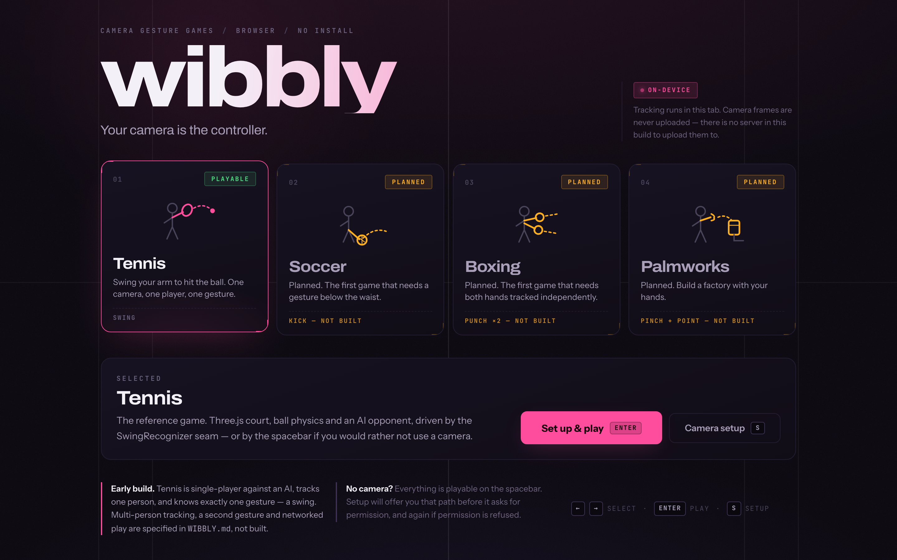
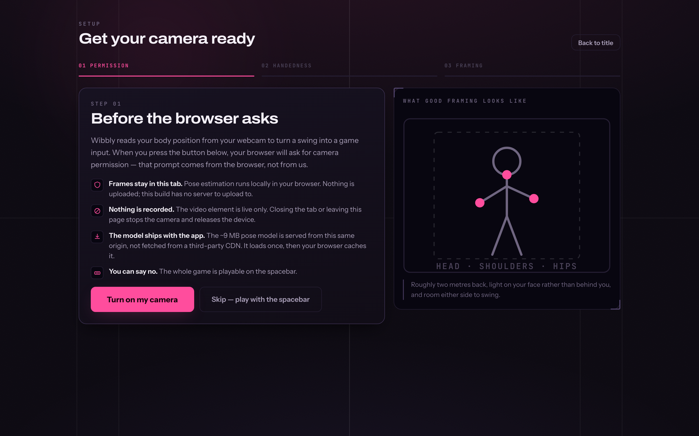
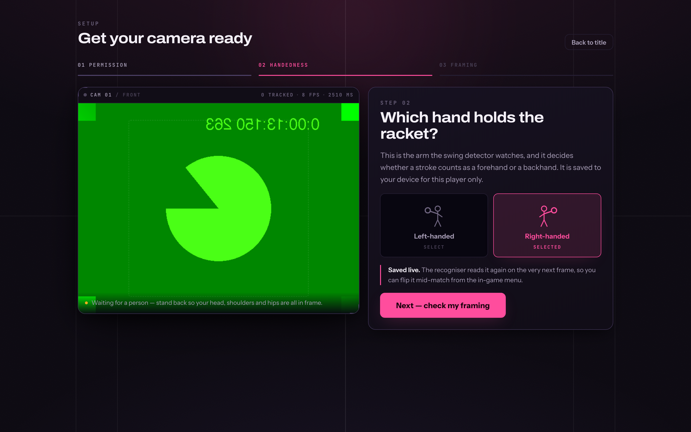
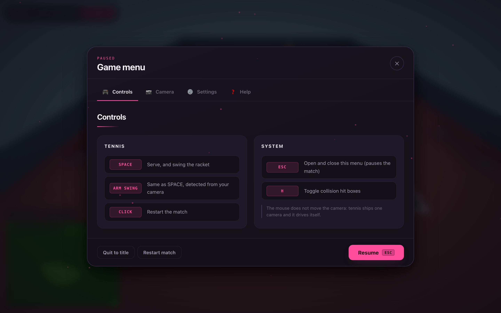
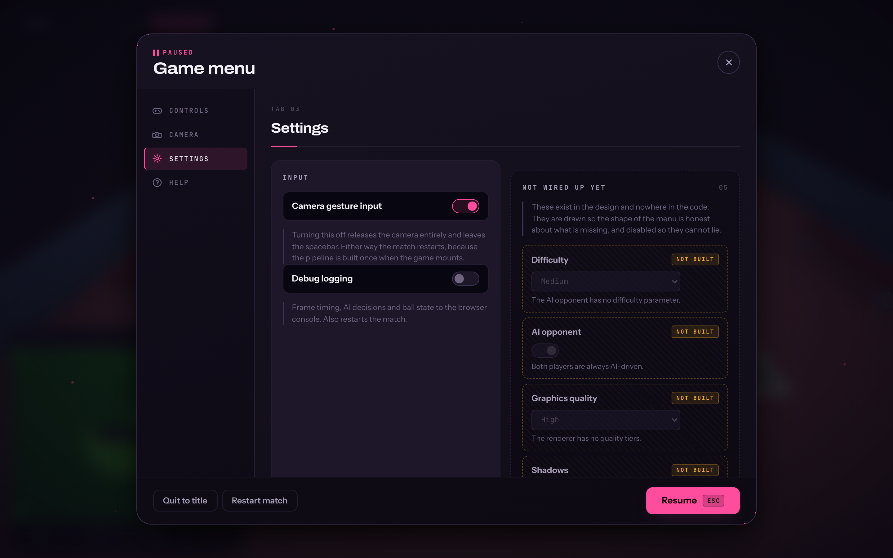
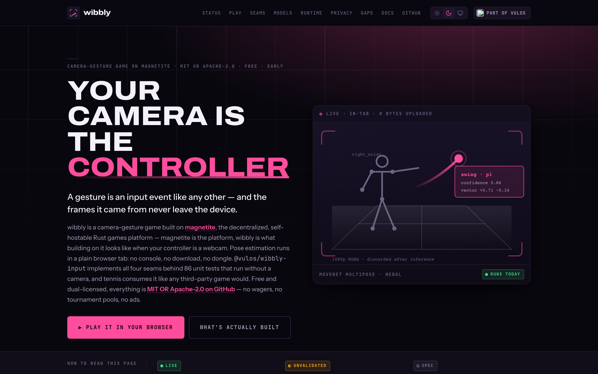
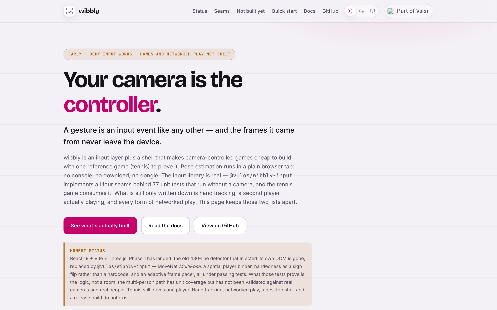

<div align="center">


# wibbly

***Your camera is the controller.***<br>
**Camera-gesture games for [magnetite](https://github.com/vul-os/magnetite) — a gesture is an input event like any other.**<br>
**Frames never leave the device. No install, no download, no depth sensor, no controller.**

[](https://react.dev)
[](https://threejs.org)
[](https://github.com/tensorflow/tfjs-models)

*Vulos — rooted in **vula**, the Zulu and Xhosa word for **open**.*



</div>

---

> ## Status: early. Most of this repo is a plan, not a product.
>
> This README will not pretend otherwise. What **plays** today is one game —
> single-camera tennis — driven by one gesture (swing) from one player. The input
> library is real and unit-tested without a camera. Hand tracking (pinch, point)
> is built as a standalone, unit-tested library, but nothing composes it into the
> running pipeline or a game yet. [Palmworks](games/palmworks) is folded in with
> its full history and builds, but nothing drives it with gestures yet.
>
> Read [`WIBBLY.md`](WIBBLY.md) for the full spec and backlog. Read the
> [status table](#status--what-is-actually-built) below for what is real.

---

## Overview

wibbly is **a game for [magnetite](https://github.com/vul-os/magnetite)** — the
decentralized, self-hostable Rust games platform. Magnetite is the platform; wibbly is
what it looks like to build on it when your controller is a webcam.

The thesis is narrow and testable: a webcam is a controller, a `GestureEvent` is an
input event like a keypress, and a game should never name a model, a runtime, or a
vendor to receive one. Games run in a browser tab with zero install. Pose inference runs
locally on the machine holding the camera, so the wire carries gesture events — not
video.

**What comes from magnetite:** a real magnetite `AuthoritativeGame` — the reference
arena-shooter, compiled to wasm — runs client-side in the browser tab via
`@vulos/wibbly-authority`, stepped from the tennis render loop as a `Topology::SingleRoom`
match: the bottom rung of magnetite's own topology ladder, hosted by the tab with no
server. That is the concrete, current sense in which wibbly is built on magnetite. It
changes nothing about camera gestures, which magnetite types `InputClass::Attested` and
are, by construction, **never replay-verifiable** — determinism is a property of the
simulation given its inputs, not of the inputs themselves. That boundary is enforced by
magnetite, in code, on purpose. Nothing here claims otherwise.

**What stays here:** the camera. `packages/wibbly-input` is a standalone,
vendor-neutral library with no magnetite dependency, so anything can consume it —
magnetite ships the contract, not a pose pipeline.

**The games** live in [`games/`](games/README.md) — see that README to submit one.

[Spec](WIBBLY.md) · [Quick start](#quick-start) · [Demo mode](#demo-mode) · [Architecture](#architecture--the-seams) · [Model selection](#model-selection) · [Docs](site/docs/)

---

## Status — what is actually built

Audited against the tree, not against the pitch.

| Capability | Status | Reality |
|---|---|---|
| `packages/wibbly-input` library | **Built** | TypeScript, zero DOM injection, 221 unit tests passing without a camera |
| `FrameSource` → `WebcamFrameSource` | **Built** | `getUserMedia`, owns its own capture loop |
| `PoseTracker` → `MoveNetMultiPoseTracker` | **Built** | MoveNet **MultiPose** Lightning, returns `Person[]`, injectable detector for tests |
| `GestureRecognizer` → `SwingRecognizer` | **Built** | Pure `detectSwing()` over wrist-velocity history; unit-testable without a camera |
| `PlayerBinder` → `SpatialBinder` | **Built, unproven** | Greedy nearest-centroid + claim zones. Tested against synthetic fixtures only — **never against two real people on a couch** |
| `Calibration` | **Built** | Per-player handedness, reach envelope, framing checks, localStorage-backed |
| Adaptive frame pacing | **Built** | Replaces the old fixed 15fps / every-3rd-frame throttle with a measured duty cycle |
| Left-handed play | **Built** | The `isRightHanded = true` hardcode is gone; handedness is a live per-player lookup |
| Tennis reference game | **Built** | Three.js court, ball physics, AI opponent, ported onto the seams |
| Firebase Analytics | **Removed** | The central tracking beacon is deleted, not replaced |
| **Multi-player on one camera** | **Partial** | The binder handles 2 players and the game requests 2 claim zones — but tennis still routes only `player_1` to the racket. **Untested with two humans.** |
| **Gesture vocabulary beyond swing** | **Partial** | `pinch` and `point` are built and unit-tested (`packages/wibbly-input/src/recognizers/`) — but not composed into `WibblyInput`'s pipeline and not driving any game yet. `punch` and `kick` remain unbuilt. |
| **Hand tracking** (MediaPipe HandLandmarker) | **Built, not wired** | `HandLandmarkTracker` exists and is unit-tested, including distance-from-camera and rotation invariance — but thresholds are derived from geometry, not a real hand, since no hand-tracking session has run against a live camera yet, and the pipeline doesn't compose it in. Its assets (the `.task` model + MediaPipe Wasm runtime, ~40 MiB) vendor same-origin on demand via `npm run vendor:hands`; the tracker already defaults to those vendored paths, so `init()` works once it's run. Not committed by default — nothing composes hands in yet, unlike the always-needed MoveNet pose model. |
| **A second game** | *Planned* | Tennis is the only consumer of the SDK, so "generalises beyond tennis" is unproven |
| **Networked play** (peer-to-peer) | **Transport built, no lobby** | `packages/wibbly-p2p`'s `PeerSession` + WebRTC offer/answer helpers are built and unit-tested, and tennis wires an optional `PeerSession` in (off unless a host page hands in a transport) — but there is no lobby screen anywhere in wibbly, so nothing turns it into a button a visitor can click. This package has **no magnetite dependency**; it is pure WebRTC. |
| **magnetite integration** | **Built, running client-side** | `@vulos/wibbly-authority` loads a real magnetite `AuthoritativeGame` — the reference arena-shooter, compiled to `wasm32-unknown-unknown` (`public/magnetite/arena-authority.wasm`, ~247 KB) — and runs it as a `Topology::SingleRoom` match: the bottom rung of magnetite's topology ladder, hosted by the tab with no server. `src/game/magnetite-authority.js` steps it once per tennis frame, fed by the match's own gesture events. This does **not** verify gesture input or add anti-cheat — magnetite classes camera gestures `InputClass::Attested` (never replay-verifiable); determinism here is a property of the simulation given its inputs, not of the inputs. **Refused in demo mode** — the demo's `default-src 'self'` CSP has no `wasm-unsafe-eval`, so wasm compilation is blocked there and `verify:demo` stays 26/26. |
| **Tauri native shell** | *Planned (phase 2)* | Researched and specified; no Rust in this repo |
| **RTMO / ONNX / WebGPU tracker** | *Planned (phase 3)* | No browser port exists to benchmark against |
| **Vendored pose model** | **Built** | MoveNet MultiPose Lightning checked in at `public/models/` (~9.3 MiB) and served same-origin. Byte-verified against its own weight manifest by `npm run verify:model`. The TF Hub CDN is now an explicit opt-in, not the default. |
| **Demo mode** (`VITE_WIBBLY_MODE=demo`) | **Built** | A separate single-surface build for embedding at `vulos.org/products/magnetite/wibbly/play/`: instant start, no router, no persistent storage, magnetite hard-disabled, local model only. Verified end-to-end under the real production CSP by `npm run verify:demo` — **26/26 checks, zero external network requests**. |
| Title screen, setup flow, in-game menu | **Built** | `src/pages/` is now four surfaces: title, first-run setup, play, 404. The marketing shell (`home`, `about`, `game-menu`, `game-container`) is deleted, along with the fabricated JSON-LD rating and play count that were still in `index.html`. The canonical public writing is `site/landing.html`. |
| **Soccer** | **In progress — reasoned, not coded** | Tracked backlog, not vague "someday": it's next because a kick is the first gesture below the waist, and `SwingRecognizer` ignores leg keypoints entirely — it forces `GestureRecognizer` to be genuinely plural. No code exists. Shows on the title screen as **Planned**, non-selectable. |
| **Boxing** | **In progress — reasoned, not coded** | Tracked backlog: it's the first game needing two independent gesture streams from one player (left and right hand, per-arm cooldowns) rather than one dominant hand, which is what `Calibration.handedness` assumes today. No code exists. Shows on the title screen as **Planned**, non-selectable. See [`src/components/catalogue.js`](src/components/catalogue.js) for both entries verbatim. |

---

## Screenshots

Generated by `npm run screenshots` against a real build. Chromium runs with a
**synthetic camera** (`--use-fake-device-for-media-stream`) — a rolling test pattern,
not a person — so no skeleton is detected and no gesture fires in any shot. Nothing
here is composited or staged.

<table>
<tr>
<td><br><em>Title — game selection; soccer and boxing show as planned, not playable</em></td>
<td><br><em>Setup — the camera is explained before the browser prompt fires</em></td>
</tr>
<tr>
<td><br><em>Setup — handedness, driven by the real <code>Calibration</code> API</em></td>
<td><br><em>Tennis (<code>/play</code>) — court, players, camera rig</em></td>
</tr>
<tr>
<td><br><em>In-game menu — salvaged from the CAMERA branch, now wired</em></td>
<td><br><em>In-game menu — settings</em></td>
</tr>
<tr>
<td><br><em>Mini-site — dark</em></td>
<td><br><em>Mini-site — light</em></td>
</tr>
</table>

Also captured: `in-game-menu-camera.png`, `not-found.png`. See
[`docs/screenshots/README.md`](docs/screenshots/README.md).

**One caveat, stated plainly.** In headless Chromium under SwiftShader, TensorFlow.js
cannot initialize a WebGL or WebGPU backend and falls back to its CPU backend, which
takes ~10-12s to come up. The pipeline does therefore run — the setup screenshots show a
live camera feed — but Chromium's synthetic stream is a rolling test pattern, not a
person, so no skeleton is drawn and `checkFraming()` correctly reports "No one detected".
That is a real verdict from the real function, not a placeholder. Regenerate with
`npm run screenshots -- --headed` on a machine with a GPU, and a person in frame, to see
tracking succeed.

---

## Quick start

```bash
git clone https://github.com/vul-os/wibbly
cd wibbly
npm install
npm run dev            # http://localhost:5173
```

Then open `/play`, allow camera access, stand about two metres back with your upper body
in frame, and swing. One player, one gesture — the honest extent of it. The spacebar
works as a fallback and the game stays fully playable if the camera is denied or the
model fails to load, which is the correct degradation.

```bash
npm run build          # production bundle → dist/
npm run preview        # serve dist/
npm test               # 338 unit tests (input seams + wibbly-p2p + wibbly-authority + app), no camera required
npm run typecheck
npm run screenshots    # requires: npm i -D playwright && npx playwright install chromium
```

### The embeddable demo

```bash
npm run build:demo     # → dist-demo/, based at /products/magnetite/wibbly/play/
npm run verify:demo    # builds it, serves it at that sub-path under the REAL
                       # production CSP, and drives it with Chromium
npm run verify:model   # re-check the vendored weights against their manifest
```

`build:demo` produces a self-contained single-surface build for embedding in a
same-origin iframe. See [Demo mode](#demo-mode) below.

### Where the model comes from

The MoveNet MultiPose Lightning weights are **vendored into this repo** at
`public/models/movenet-multipose-lightning/` (~9.3 MiB, Apache-2.0, provenance and
hashes in [its README](public/models/movenet-multipose-lightning/README.md)) and served
same-origin. This is the default in both builds.

That is not a preference, it is a requirement: the demo is embedded on a page served
under `connect-src 'self'`, where a fetch to `tfhub.dev` is refused outright and the
detector would never initialise — silently, with no error and no 404, just a game that
ignores you.

To skip the vendored weights and pull from TF Hub at runtime instead:

```bash
VITE_WIBBLY_MODEL=cdn npm run build
```

Demo builds reject that setting rather than producing a build that cannot work.

---

## Demo mode

`VITE_WIBBLY_MODE=demo` builds a different shell, not the app with bits hidden. It exists
for one deployment — a same-origin iframe on the marketing site — and that context has
constraints the normal app does not.

```bash
npm run dev:demo       # http://localhost:5173
npm run build:demo     # → dist-demo/, base /products/magnetite/wibbly/play/
npm run verify:demo    # the proof, below
```

Either build can be flipped at runtime by the host page with
`window.__WIBBLY_MODE__ = 'demo' | 'full'`, which follows the same pattern
`magnetiteConfig()` already used. All of it resolves in
[`src/mode.js`](src/mode.js) through pure functions, so the gating is unit-tested
rather than trusted.

| | Full app | Demo |
|---|---|---|
| Surfaces | title → setup → play → 404, react-router | one component, **no router at all** |
| Onboarding | 3 steps: permission → handedness → framing | one inline card: explainer + handedness, then tennis |
| Camera explainer | yes | **yes — deliberately kept** |
| Handedness | `Calibration` on `localStorage` | `Calibration` on `MemoryStorage` |
| Settings | persisted to `localStorage` | React state only |
| Pose model | vendored, same-origin | vendored, same-origin; **CDN opt-in refused** |
| TFJS backend | WebGL preferred | WebGL preferred, and a hostile fallback is **said out loud** |
| magnetite authority (`@vulos/wibbly-authority`, wasm) | on — best-effort, non-blocking | **refused** — `startMagnetiteAuthority()` throws before fetching the wasm; the demo's CSP has no `wasm-unsafe-eval` so compilation would fail anyway |
| Outbound links | in-app navigation | `target="_blank" rel="noopener"` only — never navigates the frame |

**What demo mode does not do.** It does not skip the camera explanation. A cold
`getUserMedia` prompt with no context is the worst moment in this UX, and inside an
iframe it is worse: the prompt names the *embedding* origin, so the visitor sees a
permission dialog from a site they were reading rather than the game they were looking
at. Explain, then ask — the handedness pick shares that card so it costs no extra step.

It also does not hide what this is. There is a permanent "Demo" marker, a link to this
repo, and a line stating that this is one game driven by one gesture from one player
against a local AI.

### The multiplayer step

After a few swings, a dismissible panel appears in the corner. It never blocks play,
and it says this:

> **In progress, plainly: wibbly multiplayer does not work yet.** The transport side
> is built and tested on its own — the peer session, the WebRTC offer/answer
> handshake, a compact code for putting a connection in a link — with no code path
> that touches a server anywhere in it. What is missing is a lobby: nothing in wibbly
> turns that into a screen you can actually use, so there is no invite link and
> nothing to click yet.

That warning is the point of the panel, not a disclaimer bolted to it. The pitch above
it is only that solo tennis needed no server, and that a second player is designed as
peer-to-peer — one browser tab holds authority, a WebRTC `DataChannel` carries the
other player's gesture events, opened by a one-time link or QR code exchange, no
server for anyone to run or rent. `packages/wibbly-p2p` has **no magnetite
dependency**; this panel has nothing to do with the magnetite wasm authority described
above — that link runs entirely in the full app (never in this demo embed, since its
CSP blocks wasm) and has no bearing on whether a second player can join.

### What `npm run verify:demo` actually proves

It builds the demo, serves `dist-demo/` **under `/products/magnetite/wibbly/play/`** (not at the
root, and not through `vite preview`, which knows the base and would hide a base
mistake), applies the **real production CSP** copied verbatim from
`vulos-management/pkg/cproutes/spa.go`, and drives it with Chromium using a synthetic
camera. 26 checks, all passing:

- **Zero external network requests.** Every request in the run, in full:

  ```
  /products/magnetite/wibbly/play/
  /products/magnetite/wibbly/play/assets/index-*.js
  /products/magnetite/wibbly/play/assets/index-*.css
  /products/magnetite/wibbly/play/assets/pose-detection.esm-*.js
  /products/magnetite/wibbly/play/assets/shared-*.js
  /products/magnetite/wibbly/play/models/court.glb
  /products/magnetite/wibbly/play/models/TennisCourt_BaseColor.png
  /products/magnetite/wibbly/play/models/movenet-multipose-lightning/model.json
  /products/magnetite/wibbly/play/models/movenet-multipose-lightning/group1-shard{1,2,3}of3.bin
  ```

- the detector initialises **from the local model**, on the **WebGL** backend
- no CSP violations with any consequence, and no 4xx
- **no localStorage key and no cookie survives** the page
- the spacebar path still produces swings with the camera denied
- it renders in a 420px-wide iframe with no horizontal overflow

Two real bugs were found by running this rather than assuming it:
`court.glb` was loaded from a hardcoded `/models/court.glb` that 404s under any
sub-path, and its 2 MB base-colour texture was embedded in the `.glb`, so
GLTFLoader loaded it through a `blob:` URL that `connect-src 'self'` refuses —
the court rendered untextured in production with no error and no failed request.
Both are fixed; the texture is now an external same-origin file
(`scripts/externalize-glb-textures.mjs`), which also shrank `court.glb` from
2,086,144 to 26,452 bytes.

---

## Architecture — the seams

All input lives in [`packages/wibbly-input`](packages/wibbly-input). Game code names
**only** these interfaces — never a model, a runtime, or a vendor. Swapping MoveNet for
something else is a constructor argument, not a rewrite. Every seam ships a working
default.

```
camera ──► FrameSource ──► PoseTracker ──► PlayerBinder ──► GestureRecognizer ──► game
           (pixels)        (skeletons)     (stable ids)     (events)
                                    ▲
                              Calibration
                        (handedness, reach, framing)
```

**`FrameSource`** — where pixels come from. Default `WebcamFrameSource` wraps
`getUserMedia` and owns its own capture loop. A Rust-side `NativeFrameSource` is
specified for the Tauri phase; frames never cross IPC there, only landmarks do.

**`PoseTracker`** — pixels to skeletons. `estimate()` returns `Person[]`; the plural is
the whole point. The default is `MoveNetMultiPoseTracker`. A composable hand tracker is
specified and not built.

**`PlayerBinder`** — which skeleton is which player. MoveNet returns up to six people
per frame with **no stable identity across them**, so a binder assigns durable
`PlayerId`s. `SpatialBinder` does greedy nearest-centroid matching with per-player claim
zones for the couch case. This is the highest-risk component in the project and its
tests are synthetic — occlusion, a player leaving and returning, and two players
crossing over are handled in code but have not been validated against real bodies.

**`GestureRecognizer`** — skeletons to game events. Recognizers are pure functions over
landmark history, which is what makes them unit-testable without a camera — the old
`poseDetection.js` was not. `SwingRecognizer` is the only implementation. It emits
handedness-relative strokes (`forehand`/`backhand`) rather than raw image-space
directions, so a left-handed player's forehand behaves like a forehand instead of
mirroring into the wrong shot.

**`Calibration`** — per-player handedness, reach envelope, camera-framing checks and
lighting warnings, persisted locally and keyed to `PlayerId`. Reach widens continuously
during play rather than being captured in a setup wizard.

A `GestureEvent` carries a `playerId`, a `kind`, a `confidence` in `0..1` that games
**must** handle, an optional vector, and `tCapture` — the capture timestamp, not the
detection timestamp.

---

## Model selection

Chosen after a licensing and benchmark review, written down in
[`WIBBLY.md` §4](WIBBLY.md) so nobody relitigates it.

**Body — MoveNet MultiPose Lightning (TF.js, Apache 2.0).** Up to six people, and TF.js
documents that *person count does not affect inference speed* — a flat cost curve, which
is exactly the property a 2–4 player couch game needs. It is the only multi-person model
with published **in-browser** numbers: 54 FPS on a MacBook Pro 15", 62 on a desktop
i9-10900K, 24 on an iPhone 12, all WebGL. Vendor-published, but browser-real.

**Hands — MediaPipe HandLandmarker (Apache 2.0).** 21 landmarks per hand, multi-hand,
first-class web support, and realistically the only browser option. Its eight canned
gestures are too thin for games, so classification belongs in our own recognizers over
raw landmarks. *Planned — not built.*

### Rejected, and why

The licensing traps here are the useful part.

| Model | Why not |
|---|---|
| **YOLOv8 / YOLO11-pose** | **AGPL-3.0.** Compliance requires open-sourcing the entire derivative work. A commercial non-starter without an Enterprise licence, browser demos notwithstanding. |
| **WiLoR** (best hand model) | **CC BY-NC-ND 4.0** — non-commercial *and* no-derivatives. Unusable at any price. It also depends on Ultralytics, which is AGPL. |
| **HaMeR** | Research/non-commercial terms, and MANO independently restricts commercial use. |
| **MediaPipe PoseLandmarker** | Top-down, so cost scales with the number of people. Documented failure: two people within ~75cm at 3.5m drop a detection. Google publishes no latency numbers for it. Do not build 4-player on this. |
| **RTMO** (Apache 2.0) | Architecturally the right answer — bottom-up, 0.677–0.724 COCO AP at 8.9–19.1ms. But those are **V100** numbers and there is no browser port and no WebGPU benchmark. Unproven engineering, not a drop-in. Kept as the phase-3 upgrade **behind `PoseTracker`**, where it costs one constructor change. |
| **ViTPose** | ~1 FPS on a 2080 Ti. Not real-time. |
| **MediaPipe Holistic** | Single-person only, no published benchmarks, and a stale "upgraded version coming soon" banner since 2023. |

**One runtime correction worth knowing:** MediaPipe Tasks Web's "GPU" delegate is
**WebGL, not WebGPU** — WebGPU for vision tasks is still an open upstream feature
request. Reaching WebGPU means ONNX Runtime Web. The MoveNet numbers above are WebGL.

---

## Runtime targets

**v1 is browser-first, and that is not a compromise.** Zero install is the platform's
single biggest asset — a link, a wave, a game. For seeding a game library from nothing
it beats anything native offers.

**Tauri-with-webview-ML was researched and rejected.** WebKitGTK has no WebGPU and, per
a WebKit developer, nobody is working on it; WKWebView on macOS 26 is unconfirmed and
must be tested empirically. Distro WebKitGTK ships without WebRTC, so `getUserMedia` on
Linux requires compiling WebKitGTK yourself, X11-only. macOS camera-permission bugs are
open upstream (`wry#1195`, `tauri#11951`). And you cannot escape it by shipping frames
to Rust: Tauri IPC is JSON-serialized, a 1080p RGBA frame is ~8MB, and 10MB has been
measured at ~200ms on Windows.

**Tauri as an *app shell* is still right — phase 2, with capture and inference in Rust.**
`nokhwa` for capture via V4L2, `ort` for inference with CoreML/DirectML execution
providers, a native wgpu preview surface under a transparent webview, and **only
landmarks crossing IPC** — kilobytes at 30Hz. That path also unlocks RTMO, which the
browser cannot reach. None of it exists in this repo yet.

---

## Multiplayer and the anti-cheat boundary

Two distinct problems that should not be conflated.

**Local (same camera, 2–4 players)** is `PoseTracker.maxPeople` plus `PlayerBinder`.
MoveNet's flat cost curve makes it cheap, and it is the differentiated case. The
plumbing is in place; two humans have not tested it.

**Networked (different cameras)** has each client run its own tracker and transmit
**GestureEvents, not video** — camera frames never leave the device. Sessions and
discovery are peer-to-peer (`packages/wibbly-p2p`, WebRTC, no magnetite dependency and
no server anywhere) — see [Relationship to magnetite](#relationship-to-magnetite)
below for the separate, real magnetite link, which is unrelated to this transport.

**Be clear about what anti-cheat can and cannot promise here.** Magnetite's replay
verification assumes deterministic input. Camera gesture input is a noisy,
nondeterministic sensor stream — it is the one input class that **cannot be
replay-verified**. Gesture games therefore run **client-attested**: the host simulates
authoritatively over received events, and events are rate-limited and
plausibility-checked against human-reachable velocities and cooldowns, but a determined
cheater can synthesise them. That is a real limitation, documented rather than
papered over — and it is also the reason wibbly stays its own repo instead of merging
into magnetite and blurring the property magnetite sells.

---

## Relationship to magnetite

wibbly is a **client** of [magnetite](https://github.com/vul-os/magnetite), not a fork
of it — and, as of `@vulos/wibbly-authority`, a real one: `public/magnetite/arena-authority.wasm`
is magnetite's own reference `AuthoritativeGame`, compiled to `wasm32-unknown-unknown`,
running in the browser tab as a `Topology::SingleRoom` match (the bottom rung of
magnetite's topology ladder, hosted client-side with no server), stepped once per
tennis frame by `src/game/magnetite-authority.js`. That module is what makes "wibbly is
built on magnetite" literally true, not just a stated intention.

This does not change anything about the anti-cheat boundary. magnetite is Rust and
sells deterministic authoritative simulation with replay verification for
`InputClass::Deterministic` input; camera gestures are typed `InputClass::Attested` and
are, by construction, **never replay-verifiable** — a property of the input, not of
where the authority runs. Running a real magnetite simulation in the tab does not
verify a swing was real; it means the same game module a dedicated or sharded
magnetite host would run, runs here instead. See
[Multiplayer & anti-cheat](site/docs/MULTIPLAYER.md) for the full argument.

This is unrelated to wibbly's own networked multiplayer: `packages/wibbly-p2p` is pure
WebRTC peer-to-peer with **no magnetite dependency at all** — see its
[README](packages/wibbly-p2p/README.md) for why the earlier magnetite-node design was
retired in favor of it.

---

## Repository layout

```
packages/wibbly-input/     the seams — TypeScript library, no DOM injection, 221 tests
packages/wibbly-p2p/       peer-to-peer multiplayer transport (WebRTC, no magnetite dependency), 70 tests
packages/wibbly-authority/ the real magnetite link — AuthoritativeGame compiled to wasm, run client-side
src/game/                tennis: court, ball physics, player rig, AI opponent, camera rig
src/pages/               title, setup, play, 404 — the whole app shell
site/                    house-style static mini-site + docs (the honest surface)
scripts/screenshots.mjs  Playwright screenshotter
WIBBLY.md                the spec and the program backlog
```

---

## Documentation

- [`WIBBLY.md`](WIBBLY.md) — the spec: vision, seams, model research, runtime targets, phased backlog, open questions
- [`site/docs/`](site/docs/) — overview, architecture, models, runtime targets, multiplayer, incentives, roadmap, getting started
- [`docs/screenshots/README.md`](docs/screenshots/README.md) — what each screenshot shows and how it was captured

## License

[MIT](LICENSE-MIT) OR [Apache-2.0](LICENSE-APACHE) — © VulOS. wibbly is a VulOS
project; source and issues at
[github.com/vul-os/wibbly](https://github.com/vul-os/wibbly). This covers the
whole repository, including `packages/wibbly-input` and the tennis reference game.

The models wibbly loads are separately licensed, and both are permissive: MoveNet ships
under **Apache-2.0** via [tfjs-models](https://github.com/tensorflow/tfjs-models), and
MediaPipe under **Apache-2.0**. The MoveNet weights are **vendored into this repo** under
`public/models/movenet-multipose-lightning/`, which carries its own `LICENSE` (Apache-2.0,
Google LLC) and provenance — those files are **not** covered by this repo's licence. That was a selection criterion, not luck — see
[Model selection](#model-selection) for the alternatives ruled out on licensing alone.

---

<p align="center">
  <a href="https://vulos.org"></a><br>
  <sub><a href="https://vulos.org"><b>vulos</b></a> — open by design</sub>
</p>
