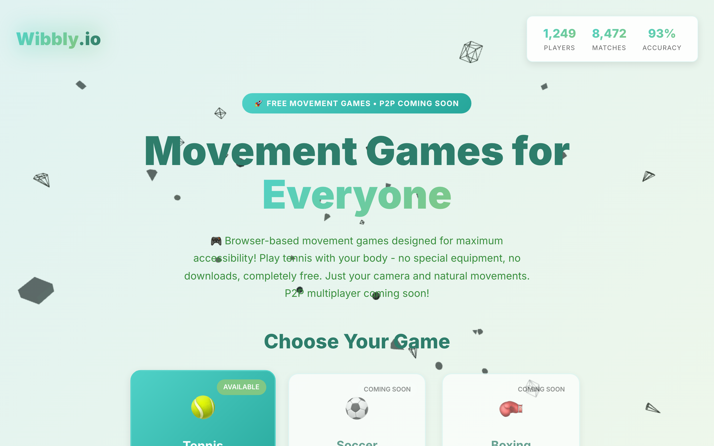

<div align="center">


# wibbly

***Your camera is the controller.***<br>
**A camera-gesture input layer for browser games — a gesture is an input event like any other.**<br>
**Frames never leave the device. No install, no download, no depth sensor, no controller.**

[](https://react.dev)
[](https://threejs.org)
[](https://github.com/tensorflow/tfjs-models)

*Vulos — rooted in **vula**, the Zulu and Xhosa word for **open**.*


</div>

---

> ## Status: early. Most of this repo is a plan, not a product.
>
> wibbly is **not** a finished platform and this README will not pretend otherwise.
> What runs today is **one game** — single-camera tennis — driven by **one gesture**
> (swing) from **one player**. The input seams described below are implemented and
> unit-tested as a library, but nothing except tennis consumes them, no second game
> exists, hand tracking is not built, and no line of wibbly code talks to magnetite.
>
> Read [`WIBBLY.md`](WIBBLY.md) for the full spec and backlog. Read the
> [status table](#status--what-is-actually-built) below for what is real.

---

## Overview

wibbly is not a tennis game. wibbly is the **input layer and shell** that makes
camera-controlled games cheap to build — plus one reference game that proves the seams
are usable rather than theoretical.

The thesis is narrow and testable: a webcam is a controller, a `GestureEvent` is an
input event like a keypress, and a game should never name a model, a runtime, or a
vendor to receive one. Games run in a browser tab with zero install. Pose inference runs
locally on the machine holding the camera, so in networked play the wire carries
gesture events — not video.

[Spec](WIBBLY.md) · [Quick start](#quick-start) · [Architecture](#architecture--the-seams) · [Model selection](#model-selection) · [Docs](site/docs/)

---

## Status — what is actually built

Audited against the tree, not against the pitch.

| Capability | Status | Reality |
|---|---|---|
| `packages/wibbly-input` library | **Built** | TypeScript, zero DOM injection, 77 unit tests passing without a camera |
| `FrameSource` → `WebcamFrameSource` | **Built** | `getUserMedia`, owns its own capture loop |
| `PoseTracker` → `MoveNetMultiPoseTracker` | **Built** | MoveNet **MultiPose** Lightning, returns `Person[]`, injectable detector for tests |
| `GestureRecognizer` → `SwingRecognizer` | **Built** | Pure `detectSwing()` over wrist-velocity history; unit-testable without a camera |
| `PlayerBinder` → `SpatialBinder` | **Built, unproven** | Greedy nearest-centroid + claim zones. Tested against synthetic fixtures only — **never against two real people on a couch** |
| `Calibration` | **Built** | Per-player handedness, reach envelope, framing checks, localStorage-backed |
| Adaptive frame pacing | **Built** | Replaces the old fixed 15fps / every-3rd-frame throttle with a measured duty cycle |
| Left-handed play | **Built** | The `isRightHanded = true` hardcode is gone; handedness is a live per-player lookup |
| Tennis reference game | **Built** | Three.js court, ball physics, AI opponent, ported onto the seams |
| Firebase Analytics | **Removed** | The central tracking beacon is deleted, not replaced |
| **Multi-player on one camera** | **Partial** | The binder handles 2 players and the game requests 2 claim zones — but tennis still routes only `player_1` to the racket. **Untested with two humans.** |
| **Gesture vocabulary beyond swing** | *Planned* | One gesture. No punch, pinch, or point. |
| **Hand tracking** (MediaPipe HandLandmarker) | *Planned* | `capabilities.hands` is `false` on the only tracker that exists |
| **A second game** | *Planned* | Tennis is the only consumer of the SDK, so "generalises beyond tennis" is unproven |
| **Networked play** | *Planned* | No transport, no lobby, no session code |
| **magnetite integration** | *Planned* | The `InputProvider` seam does not exist yet in either repo |
| **Tauri native shell** | *Planned (phase 2)* | Researched and specified; no Rust in this repo |
| **RTMO / ONNX / WebGPU tracker** | *Planned (phase 3)* | No browser port exists to benchmark against |
| Marketing pages in `src/pages/` | **Thinning out** | Fabricated counters (a hardcoded `{players: 1250, matches: 8473, accuracy: 94}` animated as if live) and a line implying P2P already shipped have been removed. Soccer and Boxing are still shown as "Coming Soon" — they are real backlog items ([`WIBBLY.md` §8](WIBBLY.md)), not shipped games. The canonical surface is `site/landing.html`; `src/pages/` shrinks into it in phase 2. |

---

## Screenshots

Generated by `npm run screenshots` against a real build. Chromium runs with a
**synthetic camera** (`--use-fake-device-for-media-stream`) — a rolling test pattern,
not a person — so no skeleton is detected and no gesture fires in any shot. Nothing
here is composited or staged.

<table>
<tr>
<td><br><em>Tennis (<code>/play</code>) — court, players, camera rig</em></td>
<td><br><em>Home (<code>/</code>) — the stale legacy shell, invented stats and all</em></td>
</tr>
<tr>
<td><br><em>Mini-site — dark</em></td>
<td><br><em>Mini-site — light</em></td>
</tr>
</table>

Also captured: `about.png`, `not-found.png`. See
[`docs/screenshots/README.md`](docs/screenshots/README.md).

**One caveat, stated plainly.** In headless Chromium under SwiftShader, TensorFlow.js
cannot initialize a WebGL or WebGPU backend — Three.js gets its own context and the
court renders, but `WibblyInput.start()` rejects, the game degrades to its spacebar
fallback, and the camera-preview panel never mounts. `play.png` therefore shows the
scene without the preview overlay. Regenerate with `npm run screenshots -- --headed` on
a machine with a real GPU to include it.

---

## Quick start

```bash
git clone https://github.com/vul-os/wibbly
cd wibbly
npm install
npm run dev            # http://localhost:5173
```

Then open `/play`, allow camera access, stand about two metres back with your upper body
in frame, and swing. One player, one gesture — the honest extent of it. The spacebar
works as a fallback and the game stays fully playable if the camera is denied or the
model fails to load, which is the correct degradation.

```bash
npm run build          # production bundle → dist/
npm run preview        # serve dist/
npm test               # 77 unit tests, no camera required
npm run typecheck
npm run screenshots    # requires: npm i -D playwright && npx playwright install chromium
```

The MoveNet weights are fetched at runtime from Google's model host on first load. There
is no offline bundle yet.

---

## Architecture — the seams

All input lives in [`packages/wibbly-input`](packages/wibbly-input). Game code names
**only** these interfaces — never a model, a runtime, or a vendor. Swapping MoveNet for
something else is a constructor argument, not a rewrite. Every seam ships a working
default.

```
camera ──► FrameSource ──► PoseTracker ──► PlayerBinder ──► GestureRecognizer ──► game
           (pixels)        (skeletons)     (stable ids)     (events)
                                    ▲
                              Calibration
                        (handedness, reach, framing)
```

**`FrameSource`** — where pixels come from. Default `WebcamFrameSource` wraps
`getUserMedia` and owns its own capture loop. A Rust-side `NativeFrameSource` is
specified for the Tauri phase; frames never cross IPC there, only landmarks do.

**`PoseTracker`** — pixels to skeletons. `estimate()` returns `Person[]`; the plural is
the whole point. The default is `MoveNetMultiPoseTracker`. A composable hand tracker is
specified and not built.

**`PlayerBinder`** — which skeleton is which player. MoveNet returns up to six people
per frame with **no stable identity across them**, so a binder assigns durable
`PlayerId`s. `SpatialBinder` does greedy nearest-centroid matching with per-player claim
zones for the couch case. This is the highest-risk component in the project and its
tests are synthetic — occlusion, a player leaving and returning, and two players
crossing over are handled in code but have not been validated against real bodies.

**`GestureRecognizer`** — skeletons to game events. Recognizers are pure functions over
landmark history, which is what makes them unit-testable without a camera — the old
`poseDetection.js` was not. `SwingRecognizer` is the only implementation. It emits
handedness-relative strokes (`forehand`/`backhand`) rather than raw image-space
directions, so a left-handed player's forehand behaves like a forehand instead of
mirroring into the wrong shot.

**`Calibration`** — per-player handedness, reach envelope, camera-framing checks and
lighting warnings, persisted locally and keyed to `PlayerId`. Reach widens continuously
during play rather than being captured in a setup wizard.

A `GestureEvent` carries a `playerId`, a `kind`, a `confidence` in `0..1` that games
**must** handle, an optional vector, and `tCapture` — the capture timestamp, not the
detection timestamp.

---

## Model selection

Chosen after a licensing and benchmark review, written down in
[`WIBBLY.md` §4](WIBBLY.md) so nobody relitigates it.

**Body — MoveNet MultiPose Lightning (TF.js, Apache 2.0).** Up to six people, and TF.js
documents that *person count does not affect inference speed* — a flat cost curve, which
is exactly the property a 2–4 player couch game needs. It is the only multi-person model
with published **in-browser** numbers: 54 FPS on a MacBook Pro 15", 62 on a desktop
i9-10900K, 24 on an iPhone 12, all WebGL. Vendor-published, but browser-real.

**Hands — MediaPipe HandLandmarker (Apache 2.0).** 21 landmarks per hand, multi-hand,
first-class web support, and realistically the only browser option. Its eight canned
gestures are too thin for games, so classification belongs in our own recognizers over
raw landmarks. *Planned — not built.*

### Rejected, and why

The licensing traps here are the useful part.

| Model | Why not |
|---|---|
| **YOLOv8 / YOLO11-pose** | **AGPL-3.0.** Compliance requires open-sourcing the entire derivative work. A commercial non-starter without an Enterprise licence, browser demos notwithstanding. |
| **WiLoR** (best hand model) | **CC BY-NC-ND 4.0** — non-commercial *and* no-derivatives. Unusable at any price. It also depends on Ultralytics, which is AGPL. |
| **HaMeR** | Research/non-commercial terms, and MANO independently restricts commercial use. |
| **MediaPipe PoseLandmarker** | Top-down, so cost scales with the number of people. Documented failure: two people within ~75cm at 3.5m drop a detection. Google publishes no latency numbers for it. Do not build 4-player on this. |
| **RTMO** (Apache 2.0) | Architecturally the right answer — bottom-up, 0.677–0.724 COCO AP at 8.9–19.1ms. But those are **V100** numbers and there is no browser port and no WebGPU benchmark. Unproven engineering, not a drop-in. Kept as the phase-3 upgrade **behind `PoseTracker`**, where it costs one constructor change. |
| **ViTPose** | ~1 FPS on a 2080 Ti. Not real-time. |
| **MediaPipe Holistic** | Single-person only, no published benchmarks, and a stale "upgraded version coming soon" banner since 2023. |

**One runtime correction worth knowing:** MediaPipe Tasks Web's "GPU" delegate is
**WebGL, not WebGPU** — WebGPU for vision tasks is still an open upstream feature
request. Reaching WebGPU means ONNX Runtime Web. The MoveNet numbers above are WebGL.

---

## Runtime targets

**v1 is browser-first, and that is not a compromise.** Zero install is the platform's
single biggest asset — a link, a wave, a game. For seeding a game library from nothing
it beats anything native offers.

**Tauri-with-webview-ML was researched and rejected.** WebKitGTK has no WebGPU and, per
a WebKit developer, nobody is working on it; WKWebView on macOS 26 is unconfirmed and
must be tested empirically. Distro WebKitGTK ships without WebRTC, so `getUserMedia` on
Linux requires compiling WebKitGTK yourself, X11-only. macOS camera-permission bugs are
open upstream (`wry#1195`, `tauri#11951`). And you cannot escape it by shipping frames
to Rust: Tauri IPC is JSON-serialized, a 1080p RGBA frame is ~8MB, and 10MB has been
measured at ~200ms on Windows.

**Tauri as an *app shell* is still right — phase 2, with capture and inference in Rust.**
`nokhwa` for capture via V4L2, `ort` for inference with CoreML/DirectML execution
providers, a native wgpu preview surface under a transparent webview, and **only
landmarks crossing IPC** — kilobytes at 30Hz. That path also unlocks RTMO, which the
browser cannot reach. None of it exists in this repo yet.

---

## Multiplayer and the anti-cheat boundary

Two distinct problems that should not be conflated.

**Local (same camera, 2–4 players)** is `PoseTracker.maxPeople` plus `PlayerBinder`.
MoveNet's flat cost curve makes it cheap, and it is the differentiated case. The
plumbing is in place; two humans have not tested it.

**Networked (different cameras)** has each client run its own tracker and transmit
**GestureEvents, not video** — camera frames never leave the device. Sessions,
discovery, and lobbies are planned to come from
[magnetite](https://github.com/vul-os/magnetite) through an `InputProvider` seam. That
seam does not exist yet in either repo.

**Be clear about what anti-cheat can and cannot promise here.** Magnetite's replay
verification assumes deterministic input. Camera gesture input is a noisy,
nondeterministic sensor stream — it is the one input class that **cannot be
replay-verified**. Gesture games therefore run **client-attested**: the host simulates
authoritatively over received events, and events are rate-limited and
plausibility-checked against human-reachable velocities and cooldowns, but a determined
cheater can synthesise them. That is a real limitation, documented rather than
papered over — and it is also the reason wibbly stays its own repo instead of merging
into magnetite and blurring the property magnetite sells.

---

## Relationship to magnetite

wibbly is a **client** of [magnetite](https://github.com/vul-os/magnetite)'s seams, not
a fork of them. magnetite is Rust and sells deterministic authoritative simulation with
replay verification; wibbly is a JavaScript input layer for a sensor stream that cannot
be replay-verified. Identity, payments, discovery, lobbies, and hosting are solved in
`magnetite-seams` and rebuilding them in JS would be waste — so the plan is to consume
them, with magnetite gaining an `InputProvider` seam and a client-attested path.

Today the two repos do not talk to each other at all.

---

## Repository layout

```
packages/wibbly-input/   the seams — TypeScript library, no DOM injection, 77 tests
src/game/                tennis: court, ball physics, player rig, AI opponent, camera rig
src/pages/               legacy marketing shell — stale, oversized, slated to shrink
site/                    house-style static mini-site + docs (the honest surface)
scripts/screenshots.mjs  Playwright screenshotter
WIBBLY.md                the spec and the program backlog
```

---

## Documentation

- [`WIBBLY.md`](WIBBLY.md) — the spec: vision, seams, model research, runtime targets, phased backlog, open questions
- [`site/docs/`](site/docs/) — overview, architecture, models, runtime targets, multiplayer, incentives, roadmap, getting started
- [`docs/screenshots/README.md`](docs/screenshots/README.md) — what each screenshot shows and how it was captured

## License

**MIT** — see [`LICENSE`](LICENSE). This covers the whole repository, including
`packages/wibbly-input` and the tennis reference game.

The models wibbly loads are separately licensed, and both are permissive: MoveNet ships
under **Apache-2.0** via [tfjs-models](https://github.com/tensorflow/tfjs-models), and
MediaPipe under **Apache-2.0**. That was a selection criterion, not luck — see
[Model selection](#model-selection) for the alternatives ruled out on licensing alone.
